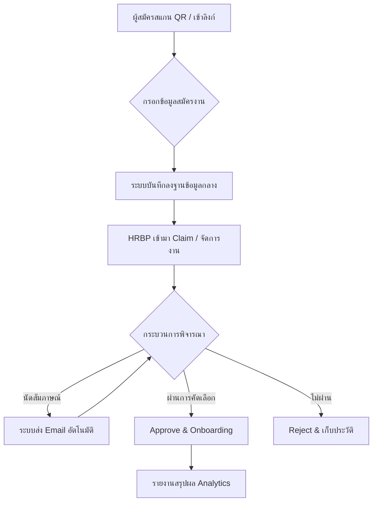

# HRBP Recruitment Ecosystem: Digital Transformation in Talent Acquisition

## 🌟 ที่มาและแรงบันดาลใจ (Vision & Origin)
ในยุคที่การสรรหาบุคลากร (Recruitment) ต้องการความรวดเร็วและแม่นยำ ระบบเดิมที่ใช้การบันทึกข้อมูลผ่าน Excel หรือกระดาษเริ่มกลายเป็นอุปสรรคต่อการเติบโตขององค์กร **HRBP Recruitment Dashboard** จึงถูกพัฒนาขึ้นมาเพื่อเปลี่ยนผ่านจากระบบ Manual สู่ Digital Transformation อย่างเต็มรูปแบบ เพื่อให้ทีม HR สามารถโฟกัสกับ "คน" ได้มากขึ้น และใช้เวลากับ "งานเอกสาร" น้อยลง

## 🚀 จุดเริ่มต้นและปัญหาที่พบ (The Starting Point)
- **Data Fragmentation**: ข้อมูลผู้สมัครกระจัดกระจายอยู่ตามไฟล์ต่างๆ ทำให้การติดตามสถานะทำได้ยาก
- **Manual Bottlenecks**: การส่งต่อข้อมูลระหว่างทีมใช้เวลามากและเสี่ยงต่อข้อมูลตกหล่น
- **Lack of Real-time Insight**: ผู้บริหารไม่สามารถมองเห็นภาพรวมของการสรรหาได้ทันที

## 💡 นวัตกรรมที่นำมาแก้ไข (Our Solutions)

### 1. ลดการบันทึกแบบเดิม (Eliminating Manual Toils)
เราเปลี่ยนการบันทึกใน Excel ที่ซับซ้อน มาเป็น **Centralized Database** บน Supabase ข้อมูลทุกอย่างถูกจัดเก็บอย่างเป็นระบบ พร้อมระบบ **Audit Log** ที่บันทึกทุกความเคลื่อนไหวโดยอัตโนมัติ ไม่ต้องคอยพิมพ์บันทึกเองในทุกขั้นตอน

### 2. ลดระยะเวลาพัฒนาแบบเก่า (Rapid Iterative Development)
ด้วยการใช้เทคโนโลยีสมัยใหม่ (React + Vite + Supabase) ควบคู่กับแนวคิด **AI-Assisted Development (VibeCode)** ทำให้เราสามารถส่งมอบระบบที่มีความซับซ้อนสูงได้ในระยะเวลาที่สั้นกว่าเดิมหลายเท่าตัว จากเดิมที่อาจใช้เวลาหลายเดือนเหลือเพียงไม่กี่สัปดาห์ แต่ยังคงไว้ซึ่งคุณภาพระดับ Enterprise

### 3. ประสบการณ์ใช้งานระดับ Premium (Visual Excellence)
ระบบถูกออกแบบโดยเน้น **UX/UI ที่ทันสมัย (Modern & Clean)** รองรับการทำงานแบบ Bilingual (ไทย-อังกฤษ) และมีความลื่นไหลสูง ช่วยให้ HRBP ใช้งานได้อย่างสบายตาและลดความเหนื่อยล้าในการทำงาน

## 🔄 ขั้นตอนการทำงานของระบบ (System Workflow)

## 🏆 บทสรุปเพื่อการนำเสนอ (The Pitch)
ระบบ HRBP นี้ไม่ได้เป็นเพียงแค่ "โปรแกรมเก็บข้อมูล" แต่เป็น **Strategic Tool** ที่ยกระดับมาตรฐานการทำงานของ HR ให้ก้าวทันเทคโนโลยี โดยการลดภาระงานรูทีน เพิ่มความโปร่งใสของข้อมูล และช่วยให้องค์กรตัดสินใจเลือกบุคลากรที่ใช่ได้รวดเร็วยิ่งขึ้น นี่คือผลลัพธ์ของการผสมผสานระหว่าง **Technical Excellence** และ **Business Understanding** อย่างแท้จริง
